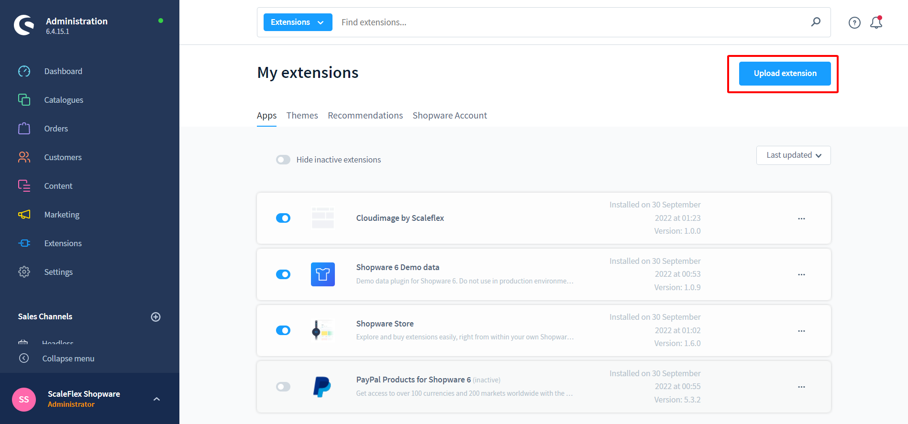
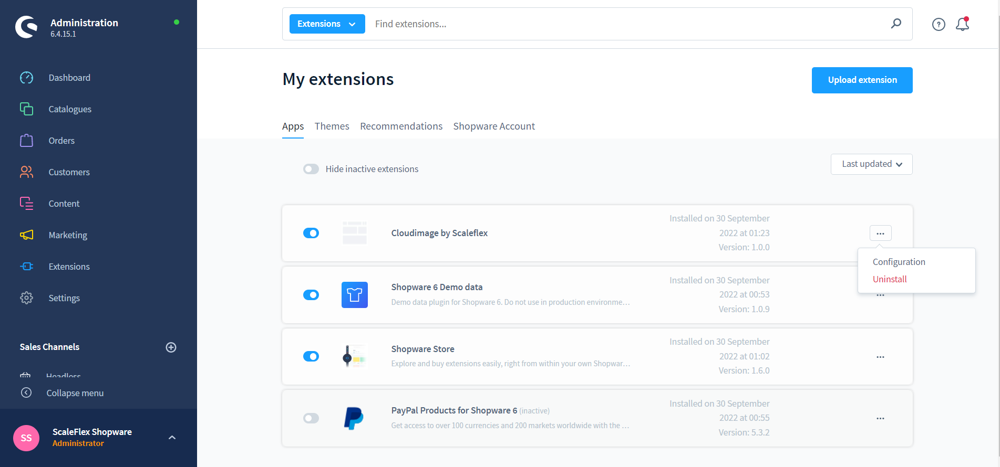
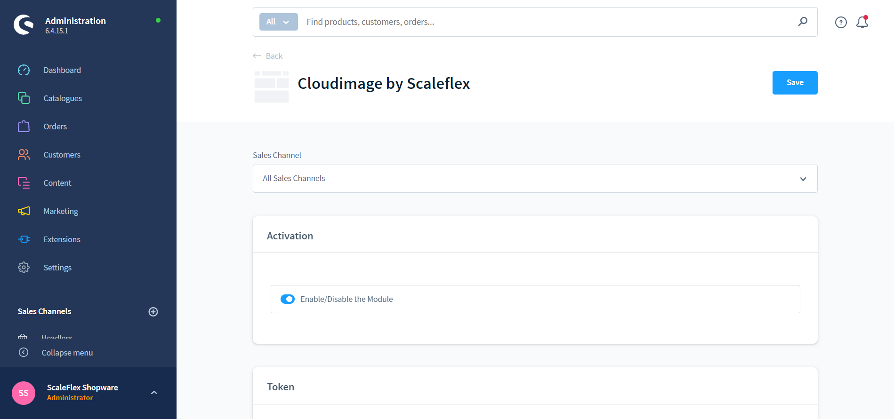

# Cloudimage Module

## Download Cloudimage module

- Step 1: Download the latest version [Download Latest release of Module](https://github.com/scaleflex/shopware-cloudimage-plugin/releases)
- Step 2: Zip the file with the name "cloudimage.zip"
- Step 3: In Admin go to Extensions -> My extensions -> Upload extension
  
  
## Installation

- Step 1: In Admin go to Extensions -> Store -> Catalog search for "Clouldimage by Scaleflex"
- Step 2: Click into extension and after that "Add extension"
- Step 3: Go to Extensions -> My extensions -> Cloudimage by Scaleflex -> Click on Configure on "Cloudimage by Scaleflex"
  
- Step 4: Update configuration and activate the Module, then your site is ready to go.
  
  
## Configuration
- Activation: Enable/Disable the module
- Cloudimage API Key: Your Cloudimage Token
- Use origin URL: If enabled, the module will only add query parameters to the image source URL without prefixing it with `{token}.cloudimg.io`.
- Lazy Load: If enabled, only images close to the current viewpoint will be loaded.
- Ignore SVG Size: If enabled, the module will ignore the image size node in the SVG file.
- Prevent Image Resize: If you set Maximum "Pixel ratio" equal to 2, but some of your assets does not have min retina size(at least 2560x960), please enable this to prevent image resized. By default, yes.
- Image Quality: The smaller the value, the more your image will be compressed. Careful — the quality of the image will decrease as well. By default, 90.
- Maximum Pixel Ratio: The maximum pixel ratio of the image. By default, 2.
- Remove V7: If enabled, the module will remove the "/v7" part in URL format. Activate for token created after October 20th 2021.

**Advanced User**
- Custom JS Function: The valid js function starting with { and finishing with }
- Custom Library Options: Modifies the library URL and must begin with the symbol &. Please read document before use.